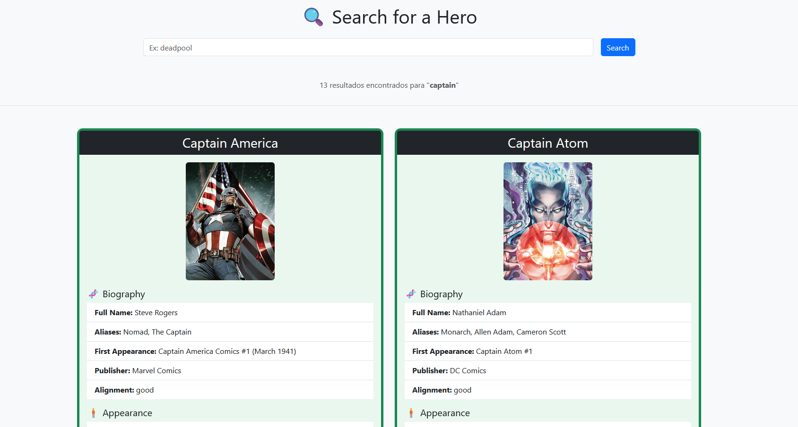
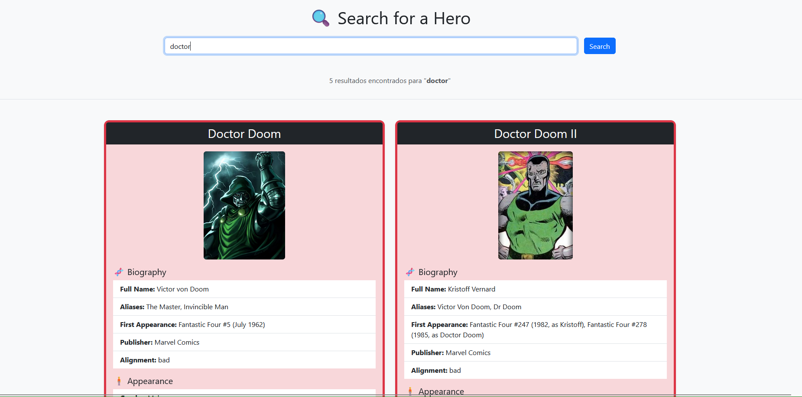

# 🔍 Heroes

Uma aplicação web simples e responsiva para buscar informações detalhadas de super-heróis, utilizando a [SuperHero API](https://superheroapi.com) como fonte de dados.

---

## 📸 Demonstração

### 🧪 Exemplo de busca: “doctor”



### 🧪 Exemplo de busca: “captain”



---

## 🚀 Tecnologias Utilizadas

- 🐍 **Python + Flask** – Backend leve e fácil de estender
- 🎨 **Bootstrap 5** – Interface moderna e responsiva
- 🌐 **SuperHero API** – Dados em tempo real de heróis
- 🐳 **Docker + Docker Compose** – Ambiente isolado com apenas um comando
- 🔐 **dotenv** – Variáveis de ambiente seguras
- 📦 **requests** – Consumo da API externa com facilidade

---

## 📂 Estrutura do Projeto

```
|-- public                  # imagens e arquivos publicos
├── src/
│   ├── app.py              # Arquivo principal Flask
│   └── templates/          # HTML com Jinja2
├── .env                    # Suas chaves privadas (não subir ao Git)
├── .env.example            # Modelo para quem for clonar o projeto
├── requirements.txt        # Dependências Python
├── docker-compose.yml      # Orquestração Docker
├── Dockerfile              # Imagem do app
```

---

## ⚙️ Como Rodar Localmente

### 🔁 Com Python local (modo dev)

```bash
python3 -m venv .venv
source .venv/bin/activate
pip install -r requirements.txt
cp .env.example .env
python src/app.py
```

> Acesse: http://localhost:5000

---

### 🐳 Com Docker (modo rápido)

```bash
docker-compose up --build
```

> Acesse: http://localhost:5000

---

## 🔐 Configuração da API Key

Acesse [SuperHero API](https://superheroapi.com), crie sua conta e obtenha uma chave de acesso (api_key)

Crie um arquivo `.env` com o seguinte conteúdo:

```env
API_KEY=coloque_sua_chave_aqui
```

Exemplo de uso no código:

```python
import os
from dotenv import load_dotenv

load_dotenv()
api_key = os.getenv("API_KEY")
```

---

## 🤝 Contribuição

1. Fork o projeto
2. Crie uma branch (`git checkout -b feat/nova-feature`)
3. Commit suas alterações (`git commit -m 'feat: adiciona nova funcionalidade'`)
4. Push para sua branch (`git push origin feat/nova-feature`)
5. Abra um Pull Request

---

## 📄 Licença

Este projeto está sob a licença MIT – sinta-se livre para usar, estudar e modificar.

---

Feito com ❤️ para quem ama super-heróis e desenvolvimento web!
